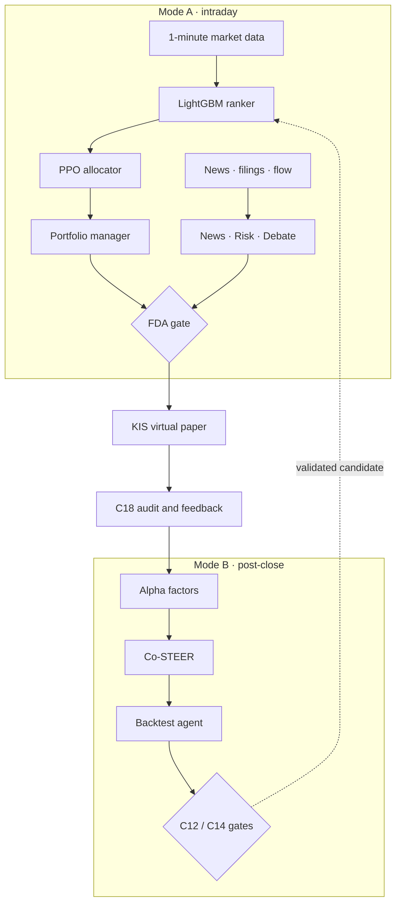

<div align="center">

# Flephant

### KOSPI 30종목 1분봉 멀티에이전트 Decision OS

장중 의사결정, 이벤트 해석, 장마감 후 모델 검증을 하나의 paper-safe 루프로 연결한 금융 AI 시스템

[](#project-result)
[](https://www.python.org/)
[](https://lightgbm.readthedocs.io/)
[](https://pytorch.org/)
[](#safety-boundary)
[](new/specs/api_contracts.md)

[Architecture](#architecture) · [Results](#project-result) · [Quick Start](#quick-start) · [Safety](#safety-boundary)

</div>

## Overview

Flephant는 **KOSPI 30종목을 매분 분석**하고, 정량 모델과 전문 에이전트의 판단을 결합해 포트폴리오 결정을 만드는 연구형 Decision OS입니다. 빠른 장중 경로와 깊은 이벤트 분석 경로를 분리하고, 모든 주문 후보는 최종 안전 게이트를 통과하도록 설계했습니다.

| | |
|---|---|
| **Universe** | KOSPI 30종목 + KOSPI200 동적 편입 후보 |
| **Cadence** | 장중 1분 Hot Path, 이벤트 기반 Cold Path, 장마감 Mode B |
| **Models** | LightGBM cross-sectional ranker + PPO allocator |
| **Agents** | Quant, News, Risk, Debate, FDA, Backtest |
| **Contracts** | C1~C18 typed contracts + Blackboard Pub/Sub |
| **Safety** | KIS virtual paper only, live trading disabled |

## Architecture



### Two Modes, Three Decision Paths

- **Hot Path** · `09:00~15:30` · target `<100ms`<br>
  1분봉 → ranking → allocation → FDA. Synchronous LLM 호출 없이 매분 실행합니다.
- **Cold Path** · event-driven · 10~30s<br>
  뉴스·공시·수급을 News, Risk, Debate Agent가 해석하고 FDA에 전달합니다.
- **Mode B** · `18:00~22:59` · post-close<br>
  팩터 탐색 → 재학습 → backtest → C12/C14 배포 후보 검증을 수행합니다.

## Project Result

**종합설계 최종 평가 A+ · 제출 범위 62개 기능 완료**

| Area | Delivered |
|---|---|
| Hot Path | LightGBM, PPO, Portfolio Manager, FDA gate |
| Cold Path | News/Risk Fast·Slow, Debate, Blackboard, Event Gateway |
| Mode B | Alpha Factor Engine, Co-STEER, Backtest Agent |
| Data | Dual-source sentiment, exogenous features, PIT-safe backfill |
| Operations | Replay gates, service readiness, KIS virtual evidence |
| Universe | KOSPI200 watch → admission/exit lifecycle |

### Validation Snapshot

아래 수치는 최종 paper-safe 검증 기록의 요약입니다. 원천 시세, 모델 binary, 계좌 정보와 broker evidence 원본은 공개본에서 제외했습니다.

- **C12 BacktestAgent**<br>
  `verdict=pass` · `deployable=true` · `leakage=pass` · `registry_mutated=false`
- **C14 service-policy replay**<br>
  `PASS` · no naked short · order caps respected · 12 days
- **Dual-source and exogenous archives**<br>
  80 days each · coverage `1.0`
- **Feature quality**<br>
  90,230 / 90,230 non-neutral rows
- **KIS paper binding**<br>
  Balance reconciliation · probe order · history match `PASS`
- **Service readiness**<br>
  `PASS` · live actions disabled

Representative backtest (`BUNDLE-20260512-0AEEE37A`, 12-day service-policy sample):

- **Signal quality:** IC `0.058`, RankIC `0.077`
- **Return / risk sample:** ARR `0.197`, SR/IR `8.31`, MDD `-0.0008`
- **Execution cost:** cost burn `38.40%`, cost-aware retraining candidate identified

> The short evaluation window can overstate annualized metrics. The result is reported as engineering evidence, not as a live-investment claim.

## Engineering Decisions

| Decision | Why it matters |
|---|---|
| **FDA is approve/veto only** | 최종 에이전트가 목표 비중을 임의 변경하지 못하게 책임 경계를 고정 |
| **PIT-safe snapshots** | 미래 정보 누출을 막기 위해 18:00 KST 기준 데이터만 사용 |
| **Hot/Cold separation** | 매분 경로의 latency를 지키면서 이벤트에는 깊은 추론 허용 |
| **Fail-closed deployment** | leakage, risk, evidence 중 하나라도 실패하면 후보 승격 차단 |
| **Typed contracts** | C1~C18을 통해 에이전트·서비스 경계의 payload drift 방지 |
| **Three-stage resilience** | connector 실패 시 retry → fallback → circuit breaker 적용 |

## Quick Start

검증 기준은 Python 3.12.13입니다. 실제 API key 없이 mock/unit 경로를 실행할 수 있습니다.

```bash
python3 -m venv .venv
source .venv/bin/activate
python -m pip install -r requirements.txt -c constraints.txt

PYTHON=$PWD/.venv/bin/python ./init.sh
PYTHON=$PWD/.venv/bin/python ./smoke.sh
```

### Run Tests

```bash
PYTHONPATH=$PWD/new .venv/bin/python -m pytest new/tests/unit -q
```

### Run the Demo

```bash
./demo.sh

PYTHONPATH=new .venv/bin/python new/src/jobs/run_final_demo.py --demo hot
PYTHONPATH=new .venv/bin/python new/src/jobs/run_final_demo.py --demo cold
PYTHONPATH=new .venv/bin/python new/src/jobs/run_final_demo.py --demo mode_b
```

## Repository Map

```text
new/
├── config/             risk, source, sector, and universe policies
├── docs/               architecture and evaluation documents
├── specs/              C1-C18 API contracts and schemas
├── src/
│   ├── agents/         Quant, News, Risk, Debate, FDA
│   ├── models/         LightGBM, PPO, Committee
│   ├── mode_b/         factor engine, Co-STEER, backtest
│   ├── connectors/     KIS, KRX, DART, Naver, ECOS, US market
│   ├── data/           PIT-safe datasets and feature stores
│   ├── execution/      paper-safe execution gateway
│   ├── orchestration/  routing, budget, fallback, circuit breaker
│   └── ops/            audit, readiness, profiling, cache
├── tests/              contract, unit, integration, E2E
└── scripts/            replay, validation, and operations tooling
```

## Safety Boundary

이 저장소는 **연구 및 모의운용용**입니다.

- `live_trading_allowed=false`
- production registry `active_version=null`
- FDA는 approve/veto만 수행
- 주문 검증은 KIS virtual paper account에서만 수행
- 실거래 키, 계좌 정보, 원천 시세, 모델 binary, runtime evidence는 저장소에 포함하지 않음

## Public Portfolio Scope

공개본은 소스 코드, 설정 예시, 계약 문서와 테스트 중심으로 구성되어 있습니다. Fresh clone에서 mock/unit 검증은 재현할 수 있지만, 과거 모델 배포 결과를 그대로 실행하려면 별도 데이터와 비공개 runtime artifacts가 필요합니다.

이 프로젝트는 투자 수익을 보장하거나 실거래 사용을 권장하지 않습니다.
